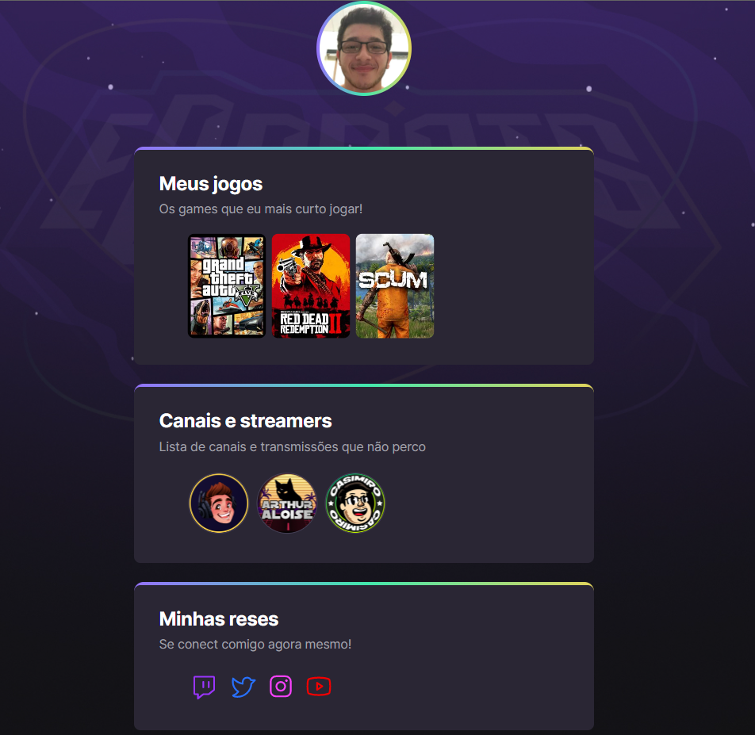
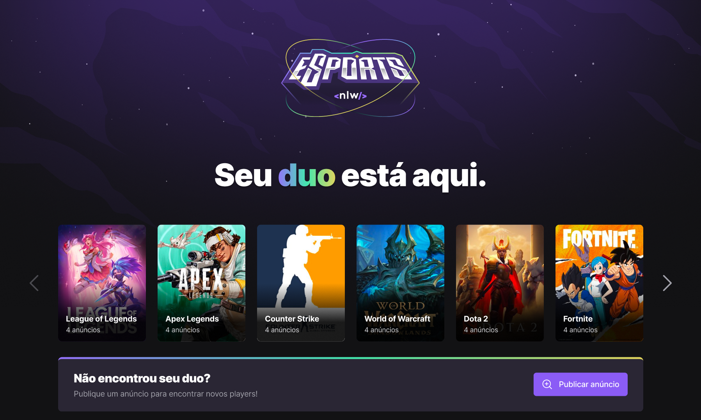
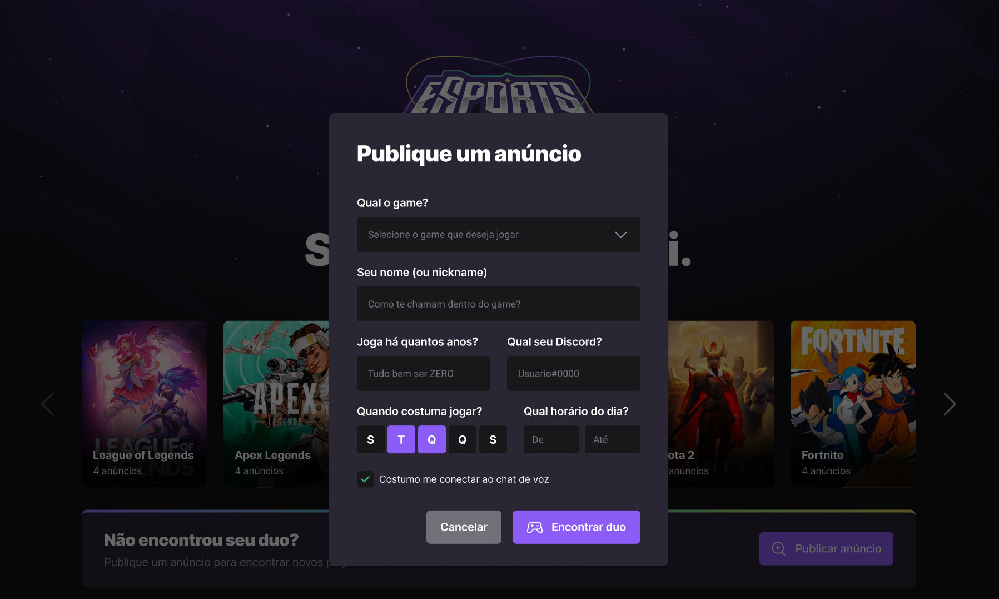
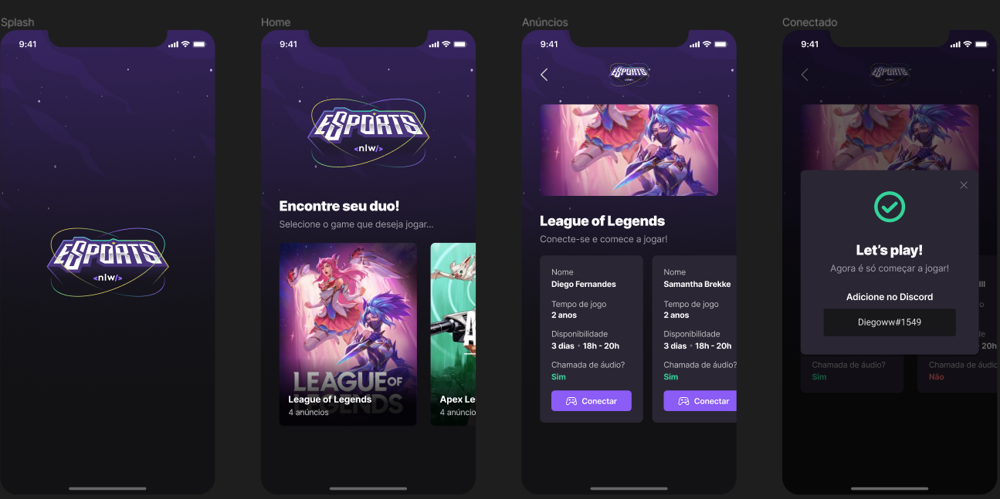

# NLW eSports 🚀

> ➯ Trilha Ignite e Explorer

## Projeto construído do evento Next Level Week da Rocketseat.
Hoje compartilho minha experiência incrível com o projeto NLW (Next Level Week) da Rocketseat, o maior evento online e gratuito de programação Full Stack, na prática.
O projeto era fazer um desenvolvimento web e aplicação mobile na área de e-Sports, contando com uma API em Node com Express, uma aplicação Web utilizando Vite e uma versão mobile com Expo para executar no IOS e Android. Tudo isso com um único objetivo: te levar para o próximo nível. Havia 2 níveis que eu poderia escolher para esse projeto: o “Explorer”, para quem está iniciando agora, e o “Ignite”, para quem já coda a mais tempo. E para me desafiar fiz ambas, com finalidade de absorver ao máximo desse evento. 
   
> Profile Gaming 🎮 

> Interface Web 💻  

> Form 📋

> Interface Mobile 📱

## 🛠️ Tecnologias

- Git e Github;
- TailwindCSS;
- JavaScript;
- TypeScript;
- Nodes.js;
- HTML
- React;
- Expo;
- Vite.

## 📧 Contato

arthur.aloise@gmail.com
